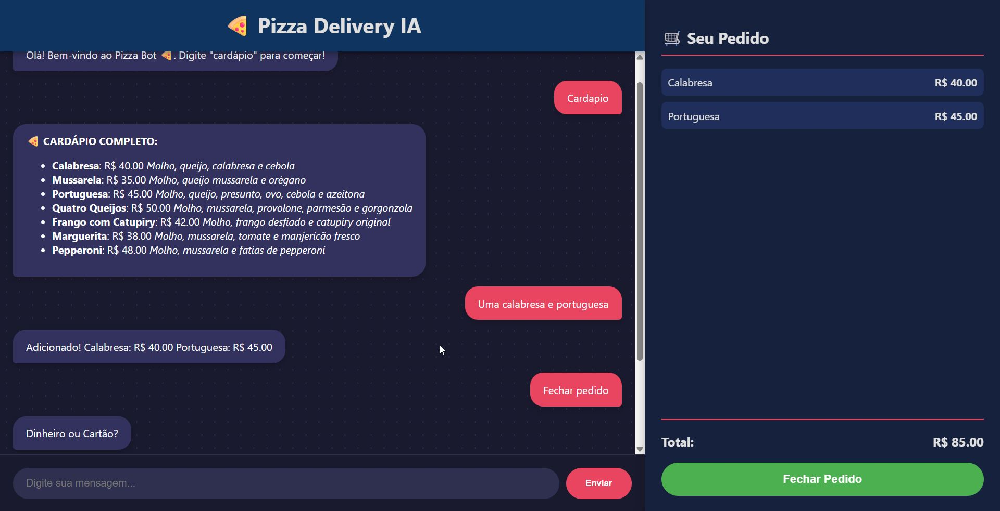
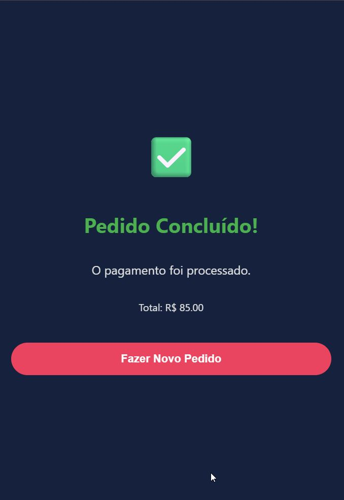

# 🍕 Pizza Bot AI - Assistente de Delivery Inteligente


> Um agente de IA Full Stack capaz de gerenciar pedidos, consultar banco de dados em tempo real e manter contexto de conversa, orquestrado via Docker.

---

## 📋 Sobre o Projeto

Este projeto é um desafio técnico moderno que simula um sistema de atendimento automatizado para uma pizzaria. Diferente de chatbots tradicionais baseados em regras simples, este projeto utiliza **GenAI (IA Generativa)** com o modelo **Llama 3.3** via Groq API.

O diferencial é a implementação de um **Agente Inteligente com LangGraph**, que permite:
1.  **Memória Persistente:** O bot lembra do contexto da conversa e dos pedidos anteriores.
2.  **Tool Calling (Uso de Ferramentas):** A IA decide autonomamente quando deve consultar o banco de dados SQL para ver preços ou cardápio.
3.  **Integração Visual:** O chat interage com o Frontend, atualizando um carrinho de compras visual em tempo real através de protocolos de comunicação ocultos.

---

## 🚀 Tecnologias Utilizadas

### Backend (Cérebro & Dados)
* **Python 3.10**: Linguagem principal.
* **FastAPI**: Framework assíncrono para expor a API REST.
* **LangGraph & LangChain**: Orquestração do fluxo da IA (StateGraph, Nós e Arestas).
* **SQLModel (SQLAlchemy)**: ORM para interação com o banco de dados.
* **PostgreSQL**: Banco de dados relacional para persistência do cardápio.
* **Groq API (Llama 3.3)**: LLM de alta performance para inferência.

### Frontend (Interface)
* **React.js (Vite)**: Construção da interface SPA (Single Page Application).
* **React Markdown**: Renderização rica de textos (negrito, listas).
* **CSS Modules**: Estilização moderna e responsiva (Dark Theme).

### Infraestrutura
* **Docker & Docker Compose**: Containerização completa (Banco, Backend e Frontend sobem com um único comando).

---

## ⚙️ Arquitetura do Agente (LangGraph)

O fluxo da IA não é linear. Ele é um grafo de estados:

1.  **Start Node**: Recebe a mensagem do usuário.
2.  **System Prompt Injection**: Define a personalidade ("Vendedor"), regras de negócio e protocolo de carrinho (`:::ADD:::`) e pagamento.
3.  **LLM Decision**: O modelo decide se responde direto ou chama uma ferramenta (Tool).
4.  **Tools Node**:
    * `get_cardapio_completo`: Consulta SQL retornando todo o menu formatado.
    * `get_pizza_price`: Consulta SQL com filtro `ILIBE` (busca flexível).
5.  **Memory Saver**: O estado da conversa é salvo para manter o contexto (sessão).

---

## 🛠️ Como Rodar o Projeto

### Pré-requisitos
* Docker e Docker Desktop instalados.
* Git instalado.
* Uma chave de API da Groq (Gratuita).

### Passo a Passo

1.  **Clone o repositório:**
    ```bash
    git clone [https://github.com/SEU-USUARIO/pizza-bot-ai.git](https://github.com/SEU-USUARIO/pizza-bot-ai.git)
    cd pizza-bot-ai
    ```

2.  **Configure as Variáveis de Ambiente:**
    Crie um arquivo `.env` na raiz do projeto com o seguinte conteúdo:
    ```ini
    # .env
    GROQ_API_KEY=gsk_SUA_CHAVE_AQUI_XXXXXXXXXXXXXXXXXXXXXX
    POSTGRES_USER=user
    POSTGRES_PASSWORD=password
    POSTGRES_DB=pizzaria
    ```

3.  **Execute com Docker Compose:**
    Na raiz do projeto, rode:
    ```bash
    docker-compose up --build
    ```

4.  **Acesse a Aplicação:**
    * **Frontend (Chat):** Abra `http://localhost:3000`
    * **Backend (Docs):** Abra `http://localhost:8000/docs`

---

## 📂 Estrutura de Pastas (Monorepo)

```text
/
├── docker-compose.yml   # Orquestração dos containers
├── .env                 # Segredos (não comitado)
├── backend/
│   ├── app/
│   │   ├── main.py      # Entrypoint da API e gestão de Sessão
│   │   ├── graph.py     # Lógica do LangGraph (Agente, Tools, Prompts)
│   │   └── database.py  # Modelos SQL e Seeding automático
│   ├── Dockerfile
│   └── requirements.txt
└── frontend/
    ├── src/
    │   └── App.jsx      # Lógica do Chat, Carrinho e Regex de Pedidos
    └── Dockerfile

## 📸 Funcionalidades em Destaque
✅ Cardápio Dinâmico: O bot consulta o banco de dados real. Se você alterar o preço no banco, o bot atualiza na hora.
✅ Carrinho Interativo: Quando a IA detecta um pedido, ela envia um comando oculto que o React intercepta para animar o carrinho lateral.
✅ Feedback Visual: Suporte a Markdown para listas e negritos, além de animações de sucesso ao fechar o pedido.
✅ Sessões Isoladas: Cada recarregamento de página gera uma nova sessão (thread_id), garantindo que o bot não confunda conversas de clientes diferentes.

## 📸 Visualização do Projeto

Aqui estão algumas capturas de tela do sistema em funcionamento:

<div align="center">
  
  
</div>

> *Interface moderna com tema escuro, suporte a Markdown e carrinho interativo.*

## 👨‍💻 Autor
Desenvolvido por **Bruno Martins** como parte de um Desafio Técnico para Dev Python. Focado em boas práticas de Engenharia de Software e Data Analysis.